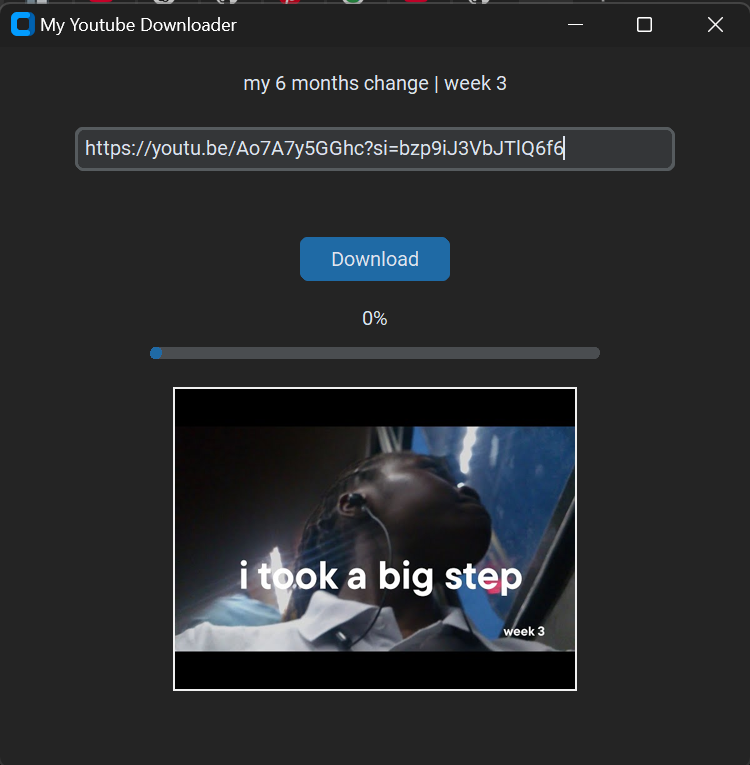

# YT-Downloader
My personal youtube downloader built with Python, PyTube and the Tkinter library.

To use it, clone the repository and open it on your computer then, "pip install" the following:

- requests  
- customtkinter  
- pillow  
- pytubefix  

When you run the code, input the link, wait for a few seconds till the video thumbnail shows up then click the download button

P.S. It doesn't work for videos that don't have the permission to be downloaded.

